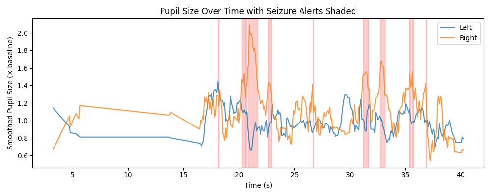

# Application of Pupillometry to Detect Seizures

## Introduction  
Epilepsy is a neurological disorder characterized by sudden, recurrent seizures that result from abnormal electrical activity in the brain. Early warning and real-time detection can greatly improve patient safety, but traditional systems—like EEG headsets—are expensive and intrusive. This project demonstrates a camera-based, non-contact approach using **pupillometry** (measurement of pupil size) to flag possible seizure events in real time.

## Motivation  
Caregivers and patients often lack affordable, easy-to-use tools for continuous seizure monitoring at home. Pupillary changes are closely tied to autonomic nervous system activity (Loddenkemper et al., 2012), and prior research shows that seizures can trigger rapid or asymmetric pupil dilation (Browne & Penry, 2019). By leveraging only a webcam and open-source software, our system aims to bridge this gap and deliver an accessible seizure-alert tool.


## System Architecture  
The software follows a **modular pipeline** of five stages:  
1. **Calibration:** Captures 30 frames of the user looking straight ahead to establish individual baseline pupil sizes.  
2. **Image Preprocessing:** Detects the eyes via dlib landmarks, converts them to grayscale, equalizes histograms, applies blur and adaptive thresholding.  
3. **Feature Extraction:** Locates the darkest circular region (the pupil) via contour analysis and measures its radius.  
4. **Anomaly Detection:** Normalizes each pupil size by its baseline, smooths via a moving average, and flags events where dilation exceeds 40% or pupils diverge by >20% for at least 5 frames.  
5. **Alerting & Logging:** Displays on-screen warnings, logs timestamped data to `session_log.csv`, and uses text-to-speech to notify the user.

## Design  
- **Language & Libraries:** Python 3, OpenCV, dlib, NumPy, pyttsx3.  
- **Calibration-driven thresholds:** Each user’s own baseline makes detection personalized and robust to individual differences.  
- **Debouncing & smoothing:** A 5-frame moving window filters out blinks and lighting flickers to avoid false positives.

## Development Process  
1. **Prototype Pupil Detection:** Built a simple OpenCV + dlib script to detect and draw pupil landmarks.  
2. **Calibration Module:** Created a one-step routine to capture baseline pupil radii.  
3. **Anomaly Logic:** Tuned dilation and asymmetry thresholds, added persistence check.  
4. **User Feedback:** Integrated text-to-speech and real-time display of zoomed eye crops.  
5. **Testing & Logging:** Recorded sessions under varied lighting to adjust parameters and ensure stability.


## Usage Instructions

Follow these steps to set up and run the seizure detection system on your own computer:

1. **Install Python 3.7+** on your machine if you do not already have it:

   * Download from [https://www.python.org/downloads/](https://www.python.org/downloads/)

2. **Clone or download** this repository:

   ```bash
   git clone https://github.com/Bernadettenakazibwe/GazeTracking.git
   cd GazeTracking
   ```

3. **Create a virtual environment** (recommended):

   ```bash
   python -m venv venv
   source venv/bin/activate   # On Windows: venv\Scripts\activate
   ```

4. **Install required libraries**:

   ```bash
   pip install -r requirements.txt
   ```

5. **Download the dlib model file**
   If not already present, download `shape_predictor_68_face_landmarks.dat` from:
   [http://dlib.net/files/shape\_predictor\_68\_face\_landmarks.dat.bz2](http://dlib.net/files/shape_predictor_68_face_landmarks.dat.bz2)
   Extract the `.dat` file and place it in the project root alongside `seizure_monitor.py`.

6. **Run the calibration and start monitoring**:

   ```bash
   python seizure_monitor.py
   ```

   * Follow the voice and on-screen prompts to look straight at the camera. 30 samples will be collected to establish your baseline.

* During Start monitoring**:

   * The system will open a live video window along with zoomed eye views.
   * Watch for voice and on-screen alerts if a possible seizure event is detected.
   * Press **ESC** to end the session.

7. **Review session logs and graphs**:

   * After session,  the gragh with details of the session will appear and you have the option to save it or not. Review `session_log.csv` for frame-by-frame data.
     
8. ## Example of gragh of the trial_sessions:
   
   

   
This graph visualizes the smoothed pupil size changes over time for both the left and right pupils, measured as a multiple of baseline (1.0 = normal). It illustrates how the pupil size varies and highlights suspected seizure events based on abnormal fluctuations.

### Key Features:
### X-Axis (Time in seconds):

Represents the duration of the observation period (~40 seconds).

### Y-Axis (Smoothed Pupil Size × Baseline):

Indicates relative changes in pupil diameter.

Values above 1.0 suggest pupil dilation; values below 1.0 indicate constriction.

### Blue Line (Left Pupil) & Orange Line (Right Pupil):

Show real-time smoothed pupil measurements for each eye.

Small oscillations are normal, while sudden large spikes or dips may indicate neurological anomalies.

### Red Shaded Areas:

Mark detected seizure alert windows where abnormal pupil activity was identified.

These regions typically correspond to rapid, asymmetric changes or irregular spikes in pupil size.

### Purpose of the Visualization:
This graph helps clinicians or researchers:

Quickly detect when a seizure-like event occurred.

Compare behavior between left and right pupils for asymmetry.

Understand the temporal pattern and intensity of pupil changes during seizure onset.

   
## Conclusion  

This project demonstrates a low-cost, non-invasive method for early seizure detection using only a webcam and open-source tools. By calibrating to each user, smoothing out noise, and applying medically informed thresholds, the system provides a responsive alert mechanism. Future work will focus on large-scale clinical testing, integration with cloud dashboards, and potential machine-learning enhancements for even greater accuracy.


